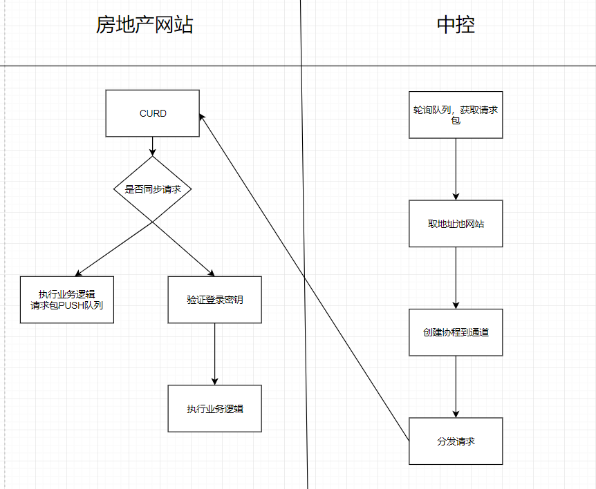

## PHP LINK

基于Swoole开发的协程HTTP分发中控。

### 流程图



***数据协议***
  - Request (请求包)
  - route (路由地址)
  - method (请求类型)
  - originHost(来源地址)
  - uuid(唯一ID)
  - extra (额外参数)

- 参考
```
{
    "request":"{STRING}",
    "route":"{STRING}",
    "method":"{STRING}",
    "originHost":"{STRING}",
    "uuid":"{STRING}",
    "extra":{OBJECT}
}
```

### 配置文件

````
conifg/appConfig.php
````

- webPools （同步的网站地址）
  -  url  （地址）
  -  port （端口）
  -  key  （认证密钥）

- processNum (并发数：网站总数 - 1) 
- redis
- taskKey (redis队列KEY)
- taskTime （轮询队列的时间间隔）
- retry （打开重试，建议关闭）
- http
  - timeout (HTTP请求超时)

### 日志说明


- 查指定网站接口响应
````
tail -f log/20201126.log |grep -E 'www.zhiye0898.com'
````
- 查请求

````
tail -f log/20201126.log |grep -E 'REQUEST'
````

- 查响应

````
tail -f log/20201126.log |grep -E 'RESPONSE'
````